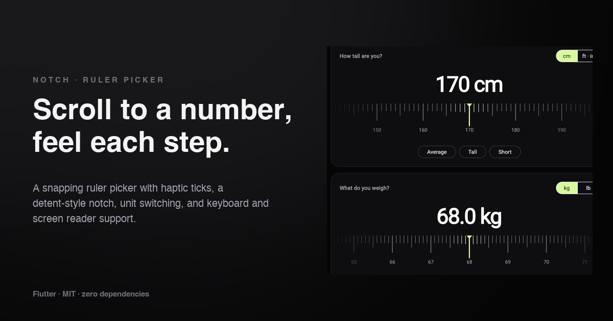

# Notch

A scrollable ruler picker for Flutter. Drag or fling the scale and it always
**comes to rest on a tick**, gives a **selection click** as each value passes,
and the centre **notch dips like a detent** so you feel every step.

**[→ Live demo](https://yagnikbarasiya23.github.io/notch_ruler_picker/)** (the example app, built for the web)



No dependencies beyond Flutter itself.

## Why a ruler

Number fields are fiddly on a phone and sliders are imprecise across wide
ranges. A ruler gives you both: fling to get close, drag to fine-tune, and the
snapping makes sure you land on a real value — 72.5 kg, not 72.4817.

## Install

```yaml
dependencies:
  notch_ruler_picker:
    git:
      url: https://github.com/YagnikBarasiya23/notch_ruler_picker.git
```

Requires Flutter 3.47 or newer.

## Use it

```dart
import 'package:notch_ruler_picker/notch_ruler_picker.dart';

NotchRulerPicker(
  value: heightCm,
  min: 90,
  max: 244,
  majorEvery: 10,
  semanticLabel: 'Height',
  semanticValueBuilder: (v) => '${v.round()} centimetres',
  onChanged: (v) => setState(() => heightCm = v),
)
```

Setting `value` from outside — a preset button, a reset — glides the ruler to
the new value.

### Units

`RulerUnits` covers the usual conversions:

```dart
final (feet, inches) = RulerUnits.cmToFeetInches(170); // (5, 7)
RulerUnits.kgToLb(68);                                 // 149.9…
```

To switch units, give the picker a new `key` and new `min`, `max` and `step`
— see `example/lib/main.dart`, which picks height in centimetres or whole
inches (labelled in feet) and weight in 0.1 kg or 1 lb steps.

### Properties

| Property | Default | |
| --- | --- | --- |
| `value`, `min`, `max` | required | Current value and range |
| `onChanged` | required | Called each time a new value reaches the notch |
| `step` | `1` | Distance between values, e.g. `0.1` |
| `majorEvery` | `10` | Every n-th step is long and labelled; aligned to round values |
| `midEvery` | `5` | Every n-th step is medium; `0` turns this off |
| `spacing` | `12` | Pixels between ticks |
| `height` | `96` | Height of the ruler |
| `color`, `mutedColor` | white, 40 % white | Ticks near the notch fade into ticks at the edges |
| `notchColor` | lime | The centre notch |
| `labelStyle` | 13 px, tabular figures | Labels under major ticks |
| `labelBuilder` | trimmed number | Custom labels, e.g. `(v) => "${v ~/ 12}'"` |
| `haptics` | `true` | Selection click per value |
| `semanticLabel` | `null` | What's being picked |
| `semanticValueBuilder` | label text | How a value is spoken |

## How it works

**A scale object.** `RulerScale` converts between scroll offsets and values:
tick *i* sits at `i × spacing` and means `min + i × step`. Values are rounded
to the step's decimals, so a 0.1 step reports `30.3`, never
`30.299999999999997`. Major ticks are chosen by value, not position, so a
scale starting at 66 lb still labels 70, 80, 90.

**Physics that always snap.** `NotchSnapPhysics` asks the platform's own
physics how far a fling would naturally travel, rounds that end point to the
nearest tick, and then runs a critically damped spring to exactly that
offset. A fling feels native; the landing is always on a value.

**Ticks that react.** Each tick reads the scroll offset and grows and
brightens as it nears the notch; a shader mask fades the ruler into the
edges. When the value under the notch changes, the picker fires
`HapticFeedback.selectionClick()` and plays a short scale-down-and-back on
the notch — the detent.

## Accessibility

- The picker is a single **slider** node: label, current value, and the
  values an increase or decrease would give. Screen reader swipe gestures
  step it, and the actions are only offered when there is somewhere to go.
- It's focusable: <kbd>←</kbd>/<kbd>→</kbd> (or <kbd>↓</kbd>/<kbd>↑</kbd>)
  step by one, <kbd>Shift</kbd> or <kbd>Page Up</kbd>/<kbd>Page Down</kbd>
  step by a major tick, <kbd>Home</kbd>/<kbd>End</kbd> jump to the ends. A
  ring around the notch shows focus.
- With *reduce motion* enabled, programmatic moves jump instead of gliding.

## Example app

```bash
cd example
flutter run            # any device — haptics are best on a real phone
flutter run -d chrome  # the web demo
```

## Tests

```bash
flutter test
```

Covers offset/value mapping, clamping, fractional steps, unit conversion,
dragging and flinging onto ticks, external value changes, keyboard input and
slider semantics.

## Licence

[MIT](LICENSE) © 2026 Yagnik Barasiya. Use it in personal and client work.

More components at [yagnikbarasiya.com/components](https://www.yagnikbarasiya.com/components).
